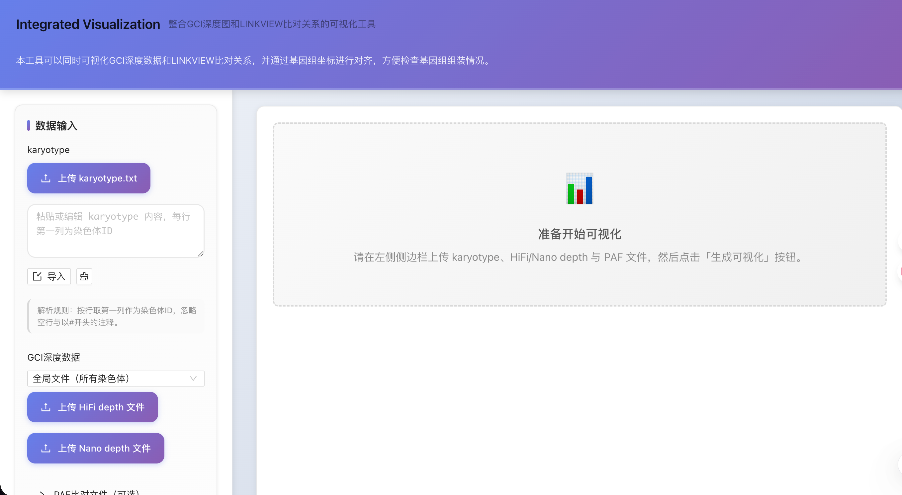

# Integrated Visualization

An interactive web tool that integrates GCI depth plots with LINKVIEW alignment visualization, aligned by genome coordinates.

## Highlights

- GCI depth visualization: upload and render `.depth.gz`/plain depth files.
- LINKVIEW alignment visualization: render genome-to-genome alignments.
- Coordinate-synchronized panels: align depth and alignment panels on the same genomic axes.
- Auxiliary lines: add vertical markers rendered across all panels.
- Configurable parameters: control resolution, panel height, window size, and more.
- PAF auto-normalization: PAF lines are automatically converted to LINKVIEW’s 6-column format.

## Installation

```bash
cd IntegratedVisualization
npm install
```

## Run (Web App)

```bash
npm start
```

Open `http://localhost:3000`.
it looks like: 

## Usage (Web UI)

- Inputs
  - Karyotype: paste or upload karyotype text.
  - Depth data:
    - Global mode: upload HiFi (`depth1`) and optionally Nano (`depth2`).
    - Per-chromosome mode: upload per-chromosome files for HiFi/Nano (A/B groups supported in the UI).
  - Alignment data (required): upload your main alignment file (PAF, BLAST, MUMmer, or LINKVIEW 6-column).
  - Optional PAF files: optionally upload HiFi/Nano PAF files; they will be merged with the main file.

- Alignment normalization
  - Raw PAF/BLAST/MUMmer outputs are accepted directly; no manual conversion is required.
  - Blank and comment lines (`#`) are ignored.

- Generate
  - Optionally configure parameters in the sidebar.
  - Click “Generate Visualization”. The SVG renders either in an interactive viewer or as inline SVG.


## Minimal Example & Demo Script

Place your test files under `example/` at the repository root. Example run (produces `images/integrated_output.svg`):
```bash
node IntegratedVisualization/cli/iv-cli.js \
  --out images/integrated_output.svg \
  --karyotype example/karyotype.txt \
  --depth1 example/hifi.depth.txt \
  --depth2 example/nano.depth.txt \
  --alignments example/alignments.txt
```

## Build

```bash
npm run build
```

## Dependencies

- React 17
- Ant Design 4
- LINKVIEW Core (local dependency)
- pako (gzip support)

## Developer Notes

- The CLI auto-detects gzip by magic bytes and supports both plain text and `.gz`.
- Depth panels are aligned to LINKVIEW output using karyotype layout; supports symmetric rendering for HiFi/Nano.
- Web UI and CLI both normalize PAF input to 6-column LINKVIEW format and log normalization statistics.

