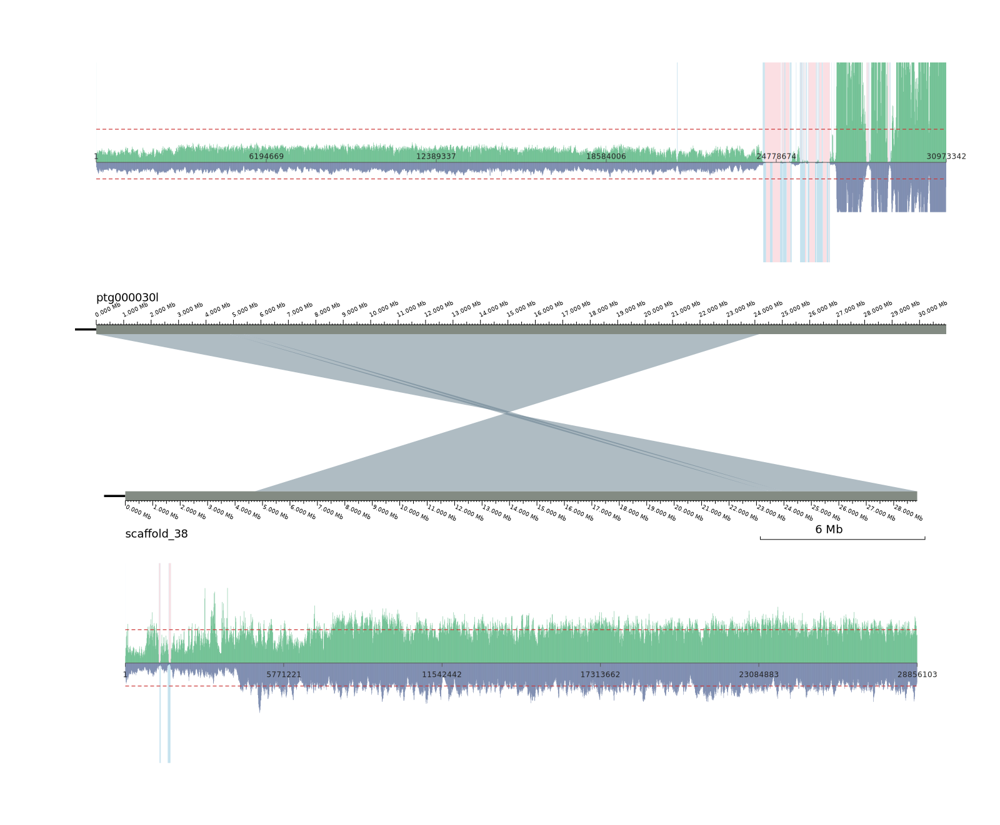

# AsmEvidenceProfile
An interactive tool for visualization of assembly coverage and synteny

## Overview
AsmEvidenceProfile provides visual evidence for genome assemblies by combining depth coverage and alignment synteny. It supports:
- Static integrated outputs (SVG/PDF) that merge LINKVIEW alignment layouts with HiFi/ONT depth panels.
- An interactive React frontend for exploring examples and building custom views.

## Key Modules
- `static/integrated_montage.py`: Integrates LINKVIEW’s chromosome layout with HiFi/ONT depth panels into a single SVG/PDF.
- `static/depth_plotter.py`: Sliding‑window statistics, zero/low‑depth region detection, and plotting utilities.
- `static/LINKVIEW.py`: Generates the intermediate SVG alignment layout.
- `IntegratedVisualization/`: React frontend for interactive visualization and example assets.
- `GCI/utility/`: Helper scripts for depth calculation, filtering, and plotting.

## Quick Start (Static Montage)
Prepare `alignments.txt`, `sequence.fa.fai`, `hifi.depth.gz`, `nano.depth.gz` (optional `karyotype.txt`), then run:
```
python3 static/integrated_montage.py example/alignment.paf -t 3 -k example/karyotype.txt --svg_width 1600 --svg_space 0.15 --fai example/sequence.fa.fai --hifi_a example/chrA.hifi.depth.gz --nano_a example/chrA.nano.depth.gz --hifi_b example/chrB.hifi.depth.gz --nano_b example/chrB.nano.depth.gz -w 10000 -o example/integrated_output --chro_axis --chro_axis_density 2 --scale_y_ratio 0.05 --max-depth-ratio 3 --panel_gap 100
```
Output: `images/integrated_output.svg`. Set `--output_format pdf` to export PDF.


## Dependencies
- Python 3.8+ and `numpy`. For PDF export, install `cairosvg` or ensure `inkscape` CLI is available.

## License
See the root `LICENSE` file.
